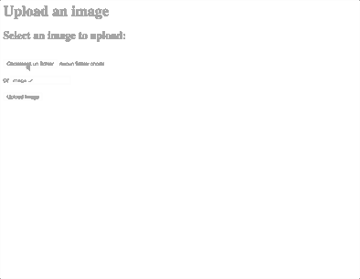

# Upload image files Node, Express and Multer.js

This example allows for uploading a file by:
- selecting a file on your machine
- entering a URL
- saving to an uploads folder on your server
- renaming the file with a datestamp
- limits file size to 1.5 MB (can be changed)

##TODO
- validation of non-conform files
	- currently allows uploading any kind of file

## Start
Type these commands in the terminal inside the folder where you cloned the repository
- `npm install` to install node modules
- `nodemon` if not installed `npm install nodemon -g`
- `open http://localhost:3000/`

## Resources
- https://github.com/expressjs/multer

---
